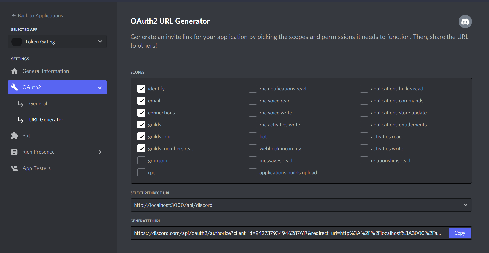
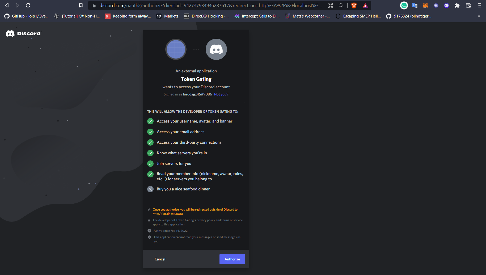
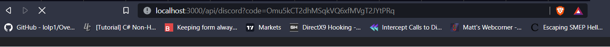

# Acquire User Access Tokens using Discord OAuth2 Code Grant

1. Visit https://discord.com/developers/applications/
2. Select the bot that you have created.
3. Click **OAuth2** Settings.
4. Click **General** Tab.
5. Add Redirect URL, ex. **http://localhost/api**
6. Click **Save Changes**.
7. Click **URL Generator**.
8. Check desired permissions.
9. Select Redirect URL.
10. Copy Generated URL.

11. Open Generated URL to in the browser.

12. Click Authorize.
13. Copy the code parameter value from the redirected URL.

14. Add it to your token request.
15. And it will return the access token.

