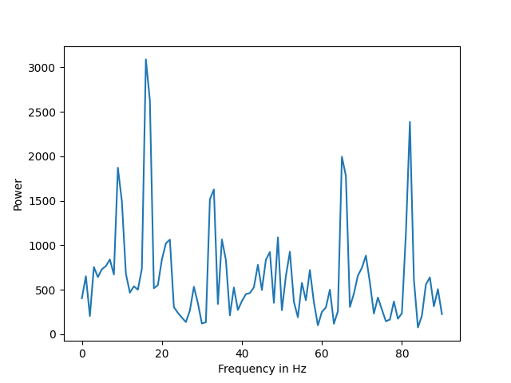

# Adding Input Dimensions

The goal of this step is to establish a workflow in determining what alternative features we can consider and evaluate whether the addition of that feature helps our model learn better or not.

## Frequency Domain

The frequency domain representation of a signal allows you to observe several characteristics of the signal that are either not easy to see, or not visible at all when you look at the signal in the time domain.

### Plot of original sample data
```python
plt.plot(sample)
```


### Hamming Window
```python
hamm_weight = np.hamming(len(sample))
plt.plot(hamm_weight)
```


### Plot of sample after applying hamming window
```python
sample_multiplied_hamm = sample * hamm_weight
plt.plot(sample_multiplied_hamm)
```


### Plot of sample in frequency domain (without hamming window)

```python
fft = np.fft.rfft(sample)
freqs = np.fft.rfftfreq(sample.size)
y = np.abs(fft)
plt.plot(freqs, y)
```


### Plot of sample in frequency domain (with hamming window)
```python
fft = np.fft.rfft(sample_multiplied_hamm)
freqs = np.fft.rfftfreq(sample_multiplied_hamm.size)
y = np.abs(fft)
plt.plot(freqs, y)
```


### Plot of sample in frequency domain (without hamming window) and mean removed
```python
sample -= sample.mean()

fft = np.fft.rfft(sample)
freqs = np.fft.rfftfreq(sample.size)
y = np.abs(fft)
plt.plot(freqs, y)
```


### Plot of sample in frequency domain (with hamming window) and mean removed


### Plot of sample side by side with its fft


### Results
```
Accuracy = 0.9702868852459017
Precision = 0.9978354978354979
Recall = 0.9715489989462592
```

## Resources
1. [Partial Introduction to Frequency-Domain Analysis](https://www.mathworks.com/help/signal/ug/practical-introduction-to-frequency-domain-analysis.html)
2. [On the use of windows in digital signal processing](https://flothesof.github.io/FFT-window-properties-frequency-analysis.html)
3. [Brief Introduction of Hamming and Hanning Function as The Preprocessing of Discrete Fourier Transform](https://towardsdatascience.com/brief-introduction-of-hamming-and-hanning-function-as-the-preprocessing-of-discrete-fourier-8b87fe538bb7)
