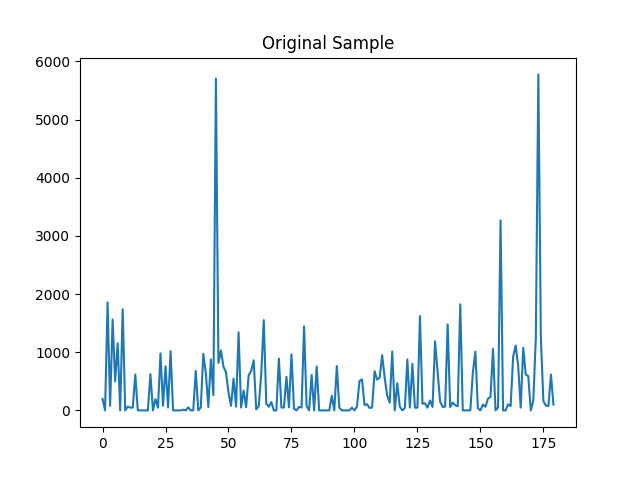

# Adding Input Dimensions

The goal of this step is to establish a workflow in determining what alternative features we can consider and evaluate whether the addition of that feature helps our model learn better or not.

## Frequency Domain

The frequency domain representation of a signal allows you to observe several characteristics of the signal that are either not easy to see, or not visible at all when you look at the signal in the time domain.

### Hamming Window
```python
hamm_weight = np.hamming(len(sample))
plt.plot(hamm_weight)
```


### Plot of original sample
```python
plt.plot(sample)
```


### Plot of sample after removing mean
```python
sample -= sample.mean()
plt.plot(sample)
```


### Sample after applying hamming filter
```python
hamm_weight = np.hamming(len(sample))
sample_multiplied_hamm = sample * hamm_weight
plt.plot(sample_multiplied_hamm)
```


### Sample converted to FFT
```python
fft = np.fft.rfft(sample_multiplied_hamm)
y = np.ndarray.tolist(np.abs(fft))
plt.plot(y)
```


### Sample appended with its own FFT
```python
new_datapoints = sample + y
plt.plot(new_datapoints)
```


## Resources
1. [Partial Introduction to Frequency-Domain Analysis](https://www.mathworks.com/help/signal/ug/practical-introduction-to-frequency-domain-analysis.html)
2. [On the use of windows in digital signal processing](https://flothesof.github.io/FFT-window-properties-frequency-analysis.html)
3. [Brief Introduction of Hamming and Hanning Function as The Preprocessing of Discrete Fourier Transform](https://towardsdatascience.com/brief-introduction-of-hamming-and-hanning-function-as-the-preprocessing-of-discrete-fourier-8b87fe538bb7)
