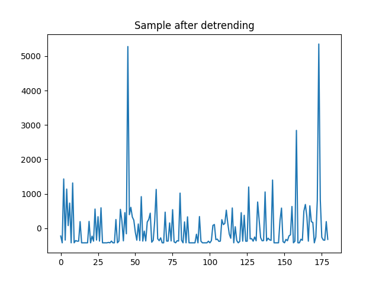
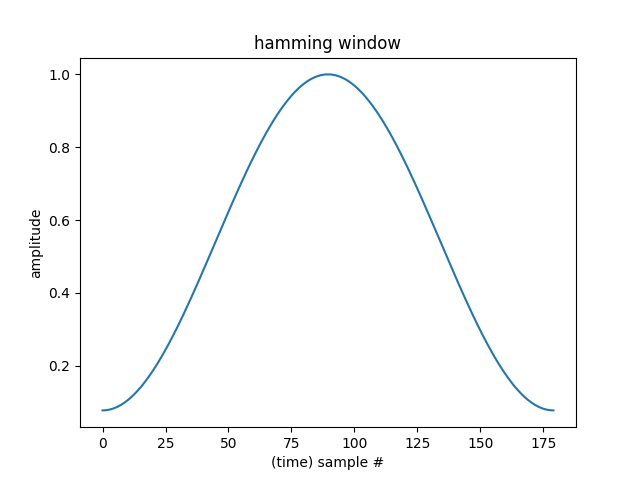

# Adding Input Dimensions
The goal of this step is to determine what other features we can consider for model training and comparing their results. One of those features we are going to take in for learning is the *frequency domain* representation of our data.

The frequency domain representation of a signal allows us to observe its characteristics that are either not easy to see (or not visible at all) when observed on time domain.

For reference, here's what the original sample looks like:
```python
plt.plot(sample)
```


## Appending the FFT to Samples

Code for appending the FFT to a sample can be found here: [`add_fft_to_sample(sample)`](../add_fft_to_sample.py)

1. Detrend the data. FFT is generally used for infinite-length of signals but since we are chopping up our signal into finite-length segments, we are making an approximation. Detrending the signal makes this approximation better. In here, we are using `scipy.signal.detrend` with `type='constant'` which will just subtract the mean from the data.

    ```python
    sample_detrended = detrend(data=sample, type='constant')
    ```

    below is a plot of the sample after detrending. Notice how the values are shifted down.

    

2. Apply hamming filter on the detrended signal. Hamming filter is a windowing technique which is also useful in improving the approximation of an infinite-length signal to a finite-length segment.

    Get the hamming weights:
    ```python
    hamm_weight = np.hamming(len(sample_detrended))
    plt.plot(hamm_weight)
    ```

    

    Apply the hamming filter:
    ```python
    sample_multiplied_hamm = sample_detrended * hamm_weight
    ```

    

3. Get the frequency domain representation using FFT
    ```python
    fft = np.fft.rfft(sample_multiplied_hamm)
    y = np.ndarray.tolist(np.abs(fft))
    plt.plot(y)
    ```

    

4. Append the result of FFT to the original sample.
    ```python
    sample_with_fft = sample + y
    plt.plot(sample_with_fft)
    ```

    

## Using the Samples With FFT to Train the Model
The process is pretty straightforward:
1. Ensure that the model input and output dimensions match.
    ```python
    autoencoder = AnomalyDetector(dimension=271)
    ```
2. Additional hidden layers can also be optionally added. Adding a hidden layer increases the capacity of the perceptron to capture and reproduce more complex input-output relationships.
    ```python
    self.encoder = tf.keras.Sequential([
      layers.Dense(128, activation='sigmoid'),
      layers.Dense(64, activation='sigmoid'),
      layers.Dense(32, activation='sigmoid'),
      layers.Dense(16, activation='sigmoid'),
      layers.Dense(8, activation='sigmoid'),
    ])

    self.decoder = tf.keras.Sequential([
      layers.Dense(16),
      layers.Dense(32),
      layers.Dense(64),
      layers.Dense(128),
      layers.Dense(dimension)
    ])
    ```
The images below are training loss of each optimizer using samples with appended FFT and with the added hidden layers (64, and 128).
```python

```

*Note: Data used here are the same 12-hour data used from previous sections. Also same values for `epoch=20` and `batch_size=128`*


Based on the images above, adding the FFT seems to have improved the overall training loss of our model (about 1 decimal place smaller loss) for optimizers `rmsprop`, `adam`, `adamax`, `nadam`, and `ftrl`.

## Resources
1. [Partial Introduction to Frequency-Domain Analysis](https://www.mathworks.com/help/signal/ug/practical-introduction-to-frequency-domain-analysis.html)
2. [On the use of windows in digital signal processing](https://flothesof.github.io/FFT-window-properties-frequency-analysis.html)
3. [Brief Introduction of Hamming and Hanning Function as The Preprocessing of Discrete Fourier Transform](https://towardsdatascience.com/brief-introduction-of-hamming-and-hanning-function-as-the-preprocessing-of-discrete-fourier-8b87fe538bb7)
