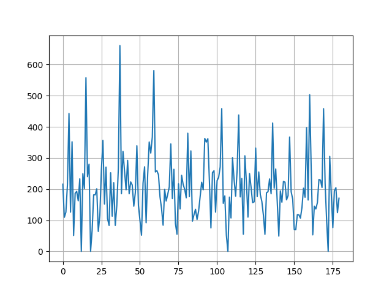
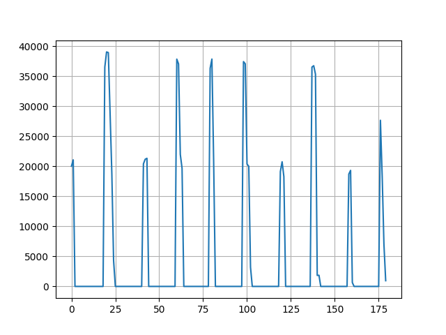

# Generating Samples
Code used to generate the samples can be found [here](../get_samples.py).

1. Raw data from Elasticsearch are converted into samples where each sample is an array with a length of 181 items.
    - Indices 0 to 179 contains the 95th percentile response times per second (in order).
    - Index 180 contains the label, either `1` or `0`.
        - `1` (positive) - indicates good sample
        - `2` (negative) - indicates anomalous sample
2. Why add labels? We need to separate the normal samples from the anomalous ones and use only those good samples as training data for the autoencoder.
3. How was anomality determined from the logs? In this use case, it's pretty straightforward since we can differentiate a normal sample from an anomalous one with relative ease based on the response times:
  - Example of a good sample:
    

  - Example of an anomalous sample:
    
