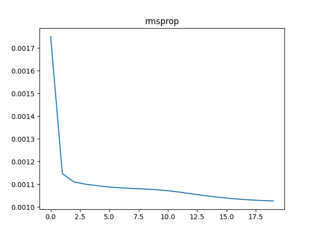
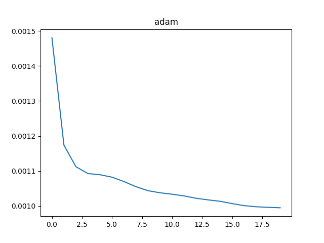
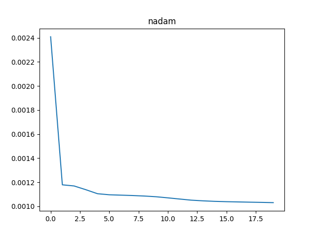

# Optimizations

## Choice of activation functions
1. If input data is binary
    - Encoder and decoder activation is typically sigmoid function
2. If input data is real number
    - Encoder activation is sigmoid function
    - Decoder activation is linear function

## Choice of loss function
1. If input data is binary
    - then the loss we need to minimize is cross-entropy
2. If input data is real number
    - then the loss we need to minimize is mean squared error

Based on the information above, we choose:
1. Encoder activation function - `sigmoid`
2. Decoder activation function - `linear`
3. Loss function - `mse`

```python
class AnomalyDetector(Model):
  def __init__(self):
    super().__init__()
    self.encoder = tf.keras.Sequential([
      layers.Dense(64, activation='sigmoid'),
      layers.Dense(32, activation='sigmoid'),
      layers.Dense(16, activation='sigmoid'),
      layers.Dense(8, activation='sigmoid'),
    ])

    self.decoder = tf.keras.Sequential([
      layers.Dense(16),
      layers.Dense(32),
      layers.Dense(64),
      layers.Dense(180)
    ])

  def call(self, x):
    encoded = self.encoder(x)
    decoded = self.decoder(encoded)
    return decoded
```

```python
autoencoder = AnomalyDetector()
autoencoder.compile(optimizer='ftrl', loss='mse')
```

With this configuration used, we are able to get significant improvements on our results:
```
Accuracy = 0.9600409836065574
Precision = 0.9989035087719298
Recall = 0.9599578503688093
```

## Choosing Optimizer
### AdaGrad
`loss: 0.0011`

### RMSprop
`loss: 4.0535e-05`

### Adadelta
`loss: 0.0069`

### Adam
`loss: 4.0756e-05`

### Adamax
`loss: 4.0533e-05`

### Nadam
`loss: 4.0730e-05`

### Ftrl
`loss: 4.1727e-05`

### SGD
`loss: 5.1800e-05`


## Resources
1. [Autoencoders](https://medium.com/@sakeshpusuluri/autoencoders-52c81a6f1ae1)
2. [Guide to Tensorflow Keras Optimizers](https://analyticsindiamag.com/guide-to-tensorflow-keras-optimizers)
