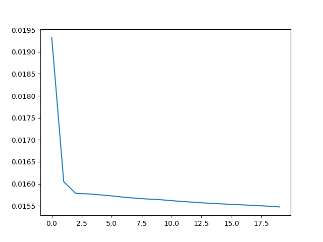

# Training The Model

Code for training the model can be found [here](../python/train.py).

1. Get the samples.
    ```python
    samples = prepare_samples(start_date, end_date)
    ```
2. Normalize the samples and cast to `tf.float32`.
    ```python
    min_val = tf.reduce_min(datapoints)
    max_val = tf.reduce_max(datapoints)

    normalized_samples = (samples - min_val) / (max_val - min_val)
    training_data = tf.cast(normalized_samples, tf.float32)
    ```
3. Instantiate the model and start training. Since an autoencoder's output seeks to copy the input as close as possible, the parameters `x` and `y` for our autoencoder model is the same `training_data`. Setting the parameter `epochs` to `20` means that the model will perform `20` passes of the entire training data. The `batch_size` parameter specifies how many samples need to be processed before the model is updated.
    ```python
    autoencoder = AnomalyDetector(dimension=180)
    autoencoder.compile(optimizer='adam', loss='mae')

    history = autoencoder.fit(
      x=training_data,
      y=training_data,
      epochs=20,
      batch_size=128,
      shuffle=True,
    )
    ```
    Here's a plot of the training loss (using only a length of 12-hour data):
    
4. Save the model.
    ```python
    autoencoder.save('/anomaly_detection')
    ```
5. Save the following parameters:
    - `min` and `max` used for the normalization
    - `threshold` - derived threshold error that classifies whether a sample is anomalous or not
