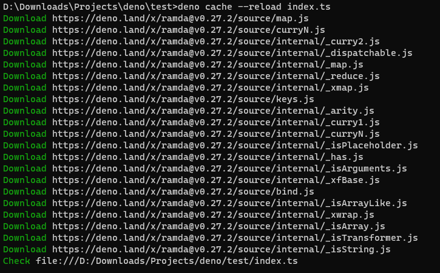

## Authors
* [meosjin](https://image.tmdb.org/t/p/original/u5yw8rQl4Qw0AMBmqkfdxrRkYx7.jpg)
## Overview
Deno is a simple, modern and secure runtime for JavaScript and TypeScript that uses V8 and is built in Rust. Created by Ryan Dahl - the original creator of Node.js. The project is intended to fix some design problems in NodeJS.

### Deno and NodeJS Comparison

- Deno ships with a single executable file so installing and using it is very quick and flexible. NodeJS has a pre-built installer for your platform or you can use external version manager like `nvm` to install multiple NodeJS version.

- Supports TypeScript out of the box (to surface more typing errors at compiling time). If we tried to run code written with TypeScript in NodeJS without using ts-node (or any other additional package), we would immediately get errors about the unknown syntax.

- DenoJS has built-in dependency inspector, code formatter, linter, and test runner. For complete list of Deno built-in tools check [here](https://deno.land/manual/tools?msclkid=15986b89b58511ec8c4a85e698e1c67c).

- Deno requires explicit permissions. Files are being executed inside a sandbox, so it has no access to the file system. There is a prompt for asking permissions when you run a .ts file. For complete list of Deno permissions, check [here](https://deno.land/manual/getting_started/permissions#permissions-list). NodeJS application by default have access to all, though in Node I haven't encountered such requirement. It is said that Deno has this permissions to utilize the v8 security features. 

- Deno API has been designed to leverage the modern javascript features. Deno supports top level await, means you can use await in your main script without having to wrap it in an async function. 

- Deno is browser compatible. Building apps that run in the browser is a completely different thing than building a Node.js application.

- NodeJS uses package managers which is by default `npm` to install packages and import them. However, DenoJS can import packages directly as URL or file paths.
   ```
  import * as R from "https://deno.land/x/ramda@v0.27.2/mod.ts";
  ```

- DenoJS does not use package.json due to some of its unnecessary information. Package.json is necessary for NodeJS applications to maintain and manage dependencies. 
  
  _If only relative files and URLs were used when importing, the path defines the version. There is no need to list dependencies_ - Ryan Dahl

- No more node_modules in Deno, in NodeJS it massively complicates the module resolution algorithm. You can cache the modules in Deno and keep all the modules in one place. Example if you have two projects: 
  - In NodeJS, those projects will have their own separate node_modules even with same modules used. 
  - In DenoJS, you can cache the module and reuse it in the other project.

    You also don't need to import the whole package, e.g. when you import ramda and you only need specific functions, it will only cache and use the required files. 
  ```
  // instead of import * as R from "https://deno.land/x/ramda@v0.27.2/mod.ts";
  import map from "https://deno.land/x/ramda@v0.27.2/source/map.js";
  ```

  

    It also cache the source files so the next time you lint your project, it will only lint the files that has changes.

- NodeJS has wider community than DenoJS. NodeJS has a lot of npm packages and sdks that are not supported in Deno, though there are module cdn that converts npm packages to be compatible in Deno, it does not cover all the packages so there is still a chance that the library you're using in NodeJS is not available in DenoJS. 

- Deno will always break on unhandled exceptions unlike NodeJS. In NodeJS, it does not stop the process immediately, it will be sent to an event `Uncaught Exception`, where you can catch it there do safe shutdown.

## Author's Take
  Deno was created to fix NodeJS design that was there a long time already that devs got "used" to it. Regardless of those quirks, Node.js is still more stable than Deno and is a relatively long-running project, and one of the leading runtimes for building cloud native microservices and backend applications. 
  
  I've read somewhere that we should not see Deno as replacement of Nodejs but as an alternative. Most devs in HOV are familiar already in NodeJS, and it wouldn't take that much effort to learn Deno, so i think i'm open to use Deno especially in solutions that requires standalone scripts.

## Goal Statements

At the end of this experiment, we should be able to;

Create a Kanban Board GraphQL API that runs in deno with these features:

[ ] Authenticate with OTP

[X] Implement Dataloaders

[X] Upload Files

[X] Manage Database (MongoDB)

[ ] Implement GraphQL Directives

[X] Dockerize Deno

[X] CI/CD

[X] Foreign Function Interface API

[ ] Going Live

## Getting Started

**With Visual Studio Code**

Install
[vscode_deno](https://marketplace.visualstudio.com/items?itemName=denoland.vscode-deno)
in vscode extensions, when installed, it will connect to the language server
built into the Deno CLI. Deno is not enabled in vscode by default and needs to
manually set "deno.enable" to true.

I suggest you create a different workspace vscode settings. In your project
folder, create a new file `.vscode/settings.json` :

```json
// .vscode/settings.json
{
  "deno.enable": true,
  "deno.lint": true,
  "deno.config": "./tsconfig.json",
  "deno.cache": "./cache",
  "editor.formatOnSave": true,
  "editor.defaultFormatter": "denoland.vscode-deno"
}
```

More information can be found in
the [Using Visual Studio Code](https://deno.land/manual@v1.16.4/vscode_deno) section
of the manual.

**Linter**

Deno ships with a built-in code linter for JavaScript and TypeScript.

```json
# lint all JS/TS files in the current directory and subdirectories
deno lint
# lint specific files
deno lint myfile1.ts myfile2.ts
# lint all JS/TS files in specified directory and subdirectories
deno lint src/
# print result as JSON
deno lint --json
# read from stdin
cat file.ts | deno lint -
```

Deno v1.14 and above linter can be customized using either a config file or cli
flags.

```json
// tsconfig.json
{
  "compilerOptions": {
    "allowJs": true,
    "lib": ["deno.window"]
  },
  "lint": {
    "files": {
      "include": ["src/"],
      "exclude": ["src/testdata/"]
    },
    "rules": {
      "tags": ["recommended"],
      "include": ["ban-untagged-todo"],
      "exclude": ["no-unused-vars"]
    }
  },
  "fmt": {
    "files": {
      "include": ["src/"],
      "exclude": ["src/testdata/"]
    },
    "options": {
      "useTabs": true,
      "lineWidth": 80,
      "indentWidth": 4,
      "singleQuote": true,
      "proseWrap": "preserve"
    }
  }
}
```

## Using NPM Packages
  Deno has a node compatibility module, which helps us to use npm packages that do not use non-polyfilled node.js APIs.

  **Using node_modules**
  
  To use npm modules in Deno, we need to import a createRequire from the https://deno.land/std/node/module.ts URL that gives us a require() function for loading the CommonJS modules.

  ```
  // app.ts
  import { createRequire } from "https://deno.land/std@0.131.0/node/module.ts";

  const require = createRequire(import.meta.url);
  // Loads native module polyfill.
  const path = require("path");
  // Loads extensionless module.
  const cjsModule = require("./my_mod");
  // Visits node_modules.
  const leftPad = require("left-pad");
  ```

  ```
  deno run --unstable --allow-read=node_modules app.ts
  ```

  *Note: the npm package should be in the node_modules folder in the current working directory*

  **Using Module CDN**

  There are a lot of module cdn that can load npm packages but for me [skypack](https://www.skypack.dev/) is best to use.

  If a popular npm package depends on a Node.js native built-in like `stream`, skypack automatically swap that with its matching Deno `std` compatibility polyfill.
  ```
  // Old code: 🚫 doesn’t work in Deno without a manual alias
  import stream from 'stream';

  // New code: ✅ uses Deno’s compatibility library instead
  import stream from 'https://deno.land/std/node/stream.ts'; 
  ```
  Loading TypeScript types from Skypack is as easy as adding a ?dts to the end of any URL, e.g. https://cdn.skypack.dev/dataloader?dts.

## Testing
  Deno has a built-in test runner that you can use for testing JavaScript or TypeScript code.

  Register a test case using Deno.test() function:
  ```
  // url_test.ts
  import { assertEquals } from "https://deno.land/std@0.133.0/testing/asserts.ts";

  Deno.test("url test", () => {
    const url = new URL("./foo.js", "https://deno.land/");
    assertEquals(url.href, "https://deno.land/foo.js");
  });
  ```
  Secondly, run the test using deno test subcommand.
  ```
  $ deno test url_test.ts
  running 1 test from file:///dev/url_test.js
  test url test ... ok (2ms)

  test result: ok. 1 passed; 0 failed; 0 ignored; 0 measured; 0 filtered out
  ```
  **Filtering**
  
  Assuming the following tests:
  ```
  Deno.test({ name: "my-test", fn: myTest });
  Deno.test({ name: "test-1", fn: test1 });
  Deno.test({ name: "test2", fn: test2 });
  ```
  This command will run all of these tests because they all contain the word "test":
  ```
  deno test --filter "test" tests/
  ```
  To let Deno know that you want to use a pattern, wrap your filter with forward-slashes like the JavaScript syntactic sugar for a REGEX.:
  ```
  deno test --filter "/test-*\d/" tests/
  ```
  Sometimes you want to ignore tests based on some sort of condition (for example you only want a test to run on Windows). For this you can use the ignore boolean in the test definition. If it is set to true the test will be skipped:
  ```
  Deno.test({
    name: "do macOS feature",
    ignore: Deno.build.os !== "darwin",
    fn() {
      doMacOSFeature();
    },
  });
  ```
  Sometimes you may be in the middle of a problem within a large test class and you would like to focus on just that test and ignore the rest for now. For this you can use the only option to tell the test framework to only run tests with this set to true:
  ```
  Deno.test({
    name: "Focus on this test only",
    only: true,
    fn() {
      testComplicatedStuff();
    },
  });
  ```
  *Note: setting `only` does not apply globally*

  **Failing Fast**
  If you have a long-running test suite and wish for it to stop on the first failure, you can specify the --fail-fast flag when running the suite:
  ```
  deno test --fail-fast
  ```

  **Parallel Execution**
  By default, the test runner queues all the test files/suites and executes them one-by-one. This gets slow when the test suite is big.
  
  To run multiple test suites in parallel using workers, a parameter called jobs can be provided to the test command:
  ```
  deno test --jobs 3
  ```
## Resources

- [deno](https://deno.land)

- [oak_graphql](https://deno.land/x/oak_graphql@0.6.2)

- [vscode_deno](https://deno.land/manual@v1.16.4/vscode_deno)

- [linter](https://deno.land/manual@v1.16.4/tools/linter)

- [node/module](https://deno.land/std@0.131.0/node/module.ts)

- [jspm](https://jspm.org/)

- [skypack](https://www.skypack.dev/blog/2021/02/skypack-npm-packages-in-deno/?msclkid=b1d7e517b49311ec92bf4819b0376ab6/)

- [testing](https://deno.land/manual/testing?msclkid=b59202a3b49411eca923f8e15be0f1d4)

- https://binary-studio.com/2021/10/05/deno-js-ts-runtime/?msclkid=76a4a06db57a11ec9639a2639312b77f
 - https://deno.land/manual/getting_started/permissions#permissions-list
 - https://deno.land/manual/tools?msclkid=15986b89b58511ec8c4a85e698e1c67c