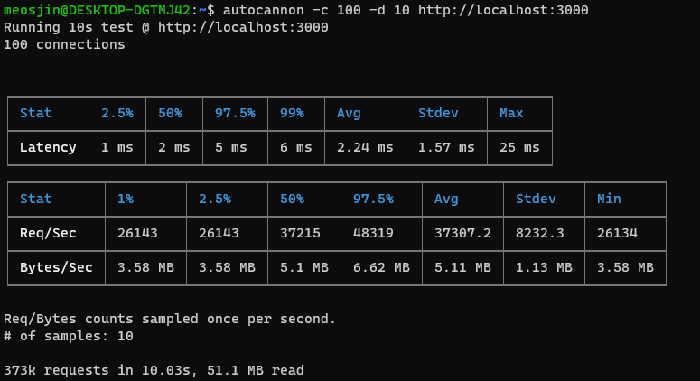
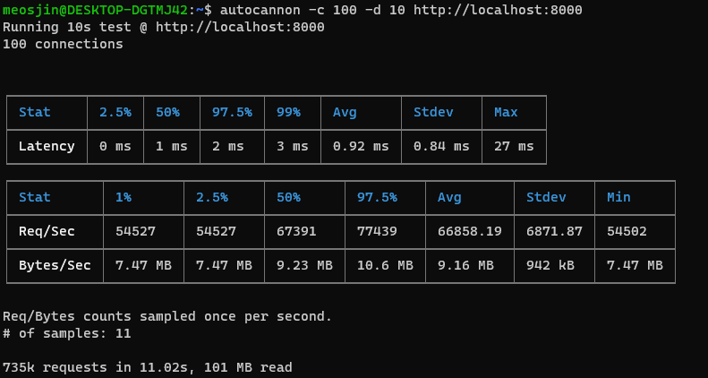
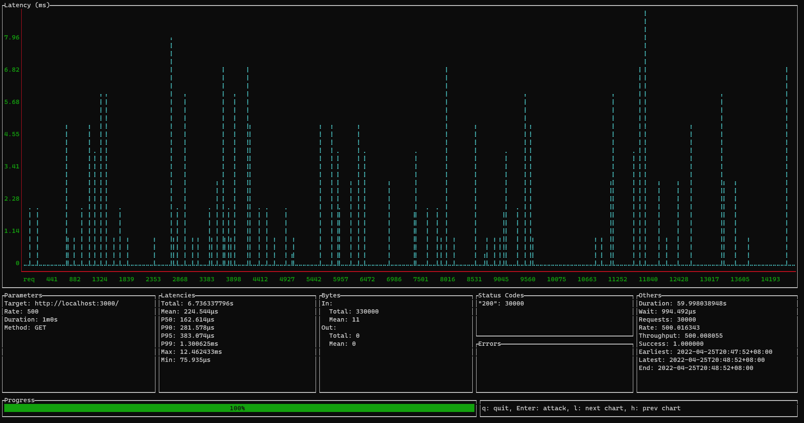
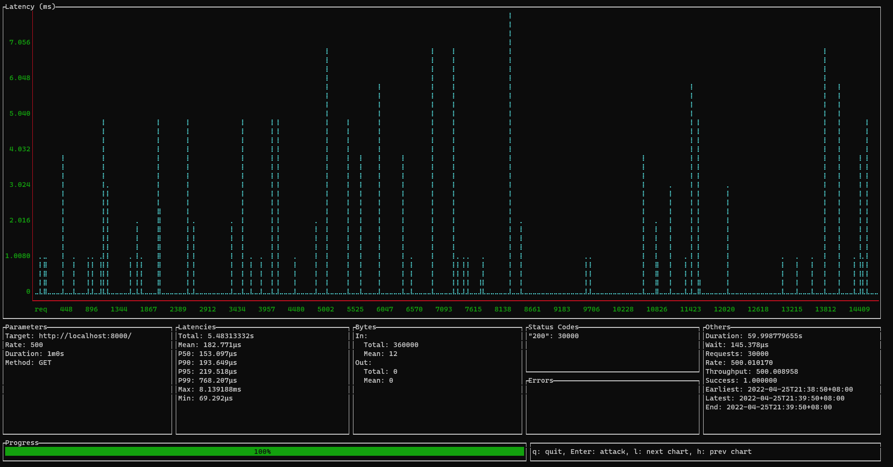
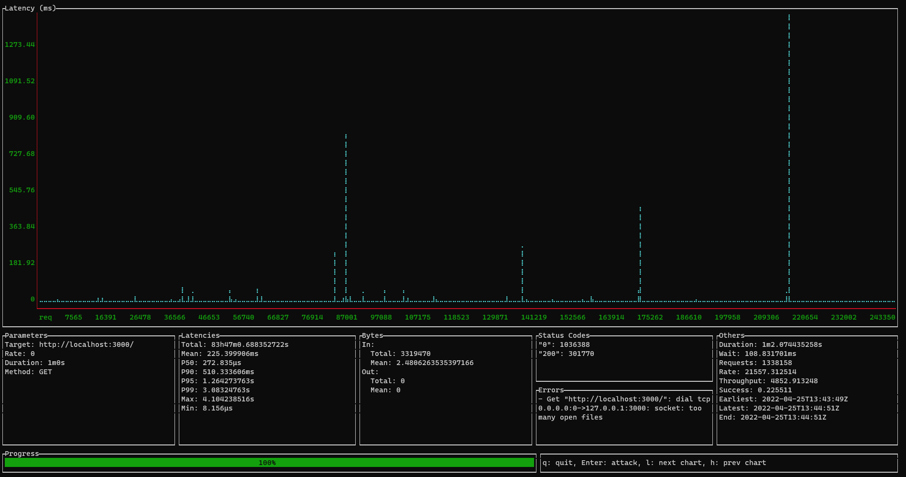
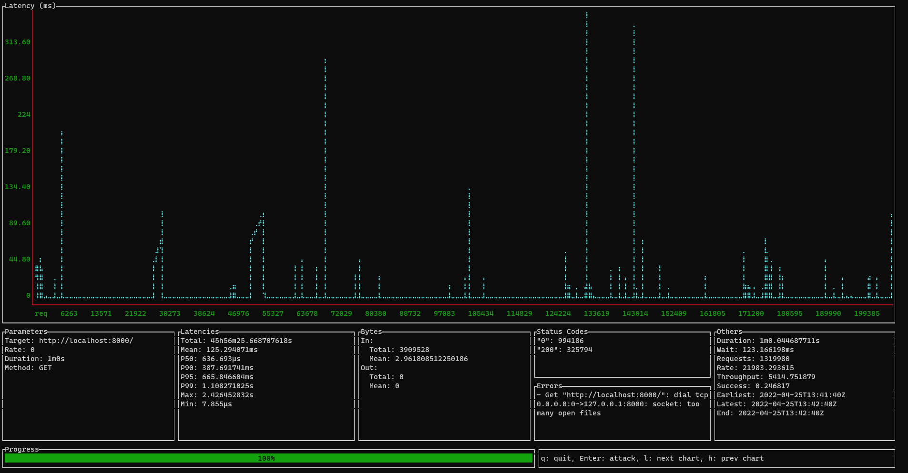
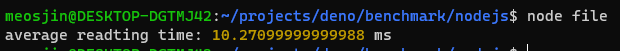
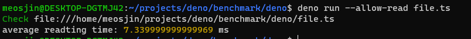
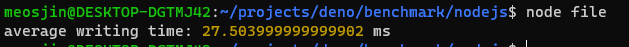
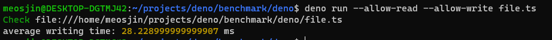

## Getting Started
  Install benchmarking tool like `autocannon` or `ali`
  ```
  $ npm i autocannon -g
  $ wget https://github.com/nakabonne/ali/releases/download/v0.7.3/ali_0.7.3_linux_amd64.deb
  $ apt install ./ali_0.7.3_linux_amd64.deb
  ```
## HTTP Server
Setup server for Nodejs:
```
// server.js
const http = require('http');

const hostname = '127.0.0.1';
const port = 3000;

const server = http.createServer((req, res) => {
  res.statusCode = 200;
  res.setHeader('Content-Type', 'text/plain');
  res.end('Hello World');
});

server.listen(port, hostname, () => {
  console.log(`Server running at http://${hostname}:${port}/`);
});
```
it will run in http://localhost:3000

Setup server for Deno:
```
// server.ts
import { serve } from 'https://deno.land/std@0.136.0/http/server.ts';
serve(() =>
	new Response('Hello World\n', {
		headers: {
			'Content-Type': 'text/plain',
		},
	}), { port: 8000 });
console.log('http://localhost:8000/');
```
it will run in http://localhost:8000

Run `autocannon` with concurrency 100 and duration 10 seconds:
NodeJS result:



Deno result:



Latency:
|         | Average       | P99           | Std Deviation |
| ------- | ------------- | ------------- | ------------- |
| Deno    | 0.92ms        | 3ms           | 0.84ms        |
| NodeJS  | 2.24ms        | 6ms           | 1.57ms        |

Number of Requesst per Second:
|         | Average       | P97.5         |
| ------- | ------------- | ------------- |
| Deno    | 66858.19      | 77439         |
| NodeJS  | 37307.2       | 48319         |


Run `ali` with duration 1 minute and rate 500:
```
$ ali --duration=1m --rate 500 http://localhost:8000
or
$ ali --duration=1m --rate 500 http://localhost:3000
```

NodeJS result:



Deno result:



From the result:
|         | Total Latency | Mean Latency  | Latency @P99  | Success Rate  |
| ------- | ------------- | ------------- | ------------- | ------------- |
| Deno    | 5.48s         | 182.77μs      | 768.2μs       | 100%          |
| NodeJS  | 6.74s         | 224.54μs      | 1.3ms         | 100%          |

Run `ali` with duration 1 minute and rate 0:
```
$ ali --duration=1m --rate 0 http://localhost:8000
or
$ ali --duration=1m --rate 0 http://localhost:3000
```

NodeJS result:



Deno result:



From the result:
|         | Mean Latency  | Latency @P99  | Rate      | Success Rate  |
| ------- | ------------- | ------------- | --------  | ------------- |
| Deno    | 125.29ms      | 1.1s          | 21983.29  | 25%           |
| NodeJS  | 225.4ms       | 3.08s         | 21557.31  | 23%           |

From the result above, Deno has lower latency and handles higher request rate than Nodejs

## File System
Given a text file with 4mb size: [test.txt](./resources/test.txt)

Create a script for both node and deno that will read the file.

in NodeJS:
```
// read-file.js
const { readFile } = require("fs").promises;
const R = require('ramda');

async function benchmark(file, runs) {

  const results = [];

  for (let i = 0; i < runs; i++) {
    const start = Date.now();

    await readFile(file, {
      encoding: "utf8",
    });

    const stop = Date.now();

    results.push((stop - start) / 1000);
  }

  console.log(
    'average reading time:',
    (R.sum(results)) / (results.length),
    'ms',
  );
}

benchmark('../resources/2.txt', 1000);
```

in Deno:
```
//read-file.ts
import { sum } from 'https://deno.land/x/ramda@v0.27.2/mod.ts';

async function benchmark(file: string, runs: number) {
	const results = [];

	for (let i = 0; i < runs; i++) {
		const start = Date.now();

		await Deno.readTextFile(file);

		const stop = Date.now();

		results.push((stop - start) / 1000);
	}

	console.log(
		'average reading time:',
		(sum(results)) / (results.length),
		'ms',
	);
}

benchmark('../resources/test.txt', 1000);
```

NodeJS result:



Deno result:



Create a script for both node and deno that will read the file and write it to new file.

in NodeJS:
```
// write-file.js
const { readFile, writeFile } = require("fs").promises;
const R = require('ramda');

async function benchmark(file, runs) {

  const results = [];

  const data = await readFile(file, {
    encoding: "utf8",
  });

  for (let i = 0; i < runs; i++) {
    const start = Date.now();

    await writeFile(`./output.txt`, data);

    const stop = Date.now();

    results.push((stop - start) / 1000);
  }

  console.log(
    'average writing time:',
    (R.sum(results)) / (results.length),
    'ms',
  );
}

benchmark('../resources/test.txt', 1000);
```

in Deno:
```
//write-file.ts
import { sum } from 'https://deno.land/x/ramda@v0.27.2/mod.ts';

async function benchmark(file: string, runs: number) {
	const results = [];

	const data = await Deno.readTextFile(file);

	for (let i = 0; i < runs; i++) {
		const start = Date.now();

		await Deno.writeTextFile(`./output.txt`, data);

		const stop = Date.now();

		results.push((stop - start) / 1000);
	}

	console.log(
		'average writing time:',
		(sum(results)) / (results.length),
		'ms',
	);
}

benchmark('../resources/test.txt', 1000);
```

NodeJS result:



Deno result:



Result:
|         | Average Read Time | Average Write Time  |
| ------- | ----------------- | ------------------- |
| Deno    | 7.34ms            | 28.23ms             |
| NodeJS  | 10.27ms           | 27.5ms              |

From the result above, Deno has significant difference in average read time than NodeJS, and it has slight difference in average write execution time.

