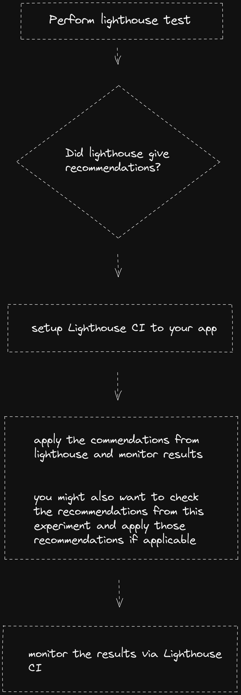
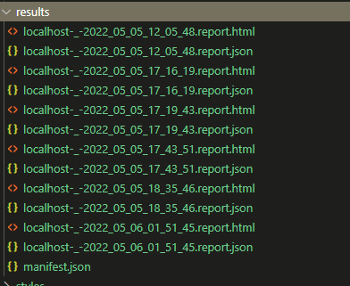

## Authors

- [Glevinzon Dapal](https://app.identifi.com/profile/00a0128bdc38887a855480f7c38ffe84)
- [ALEXANDER SARITA](https://app.identifi.com/profile/00797e4189900e4762e3f459337dd735)

## Goal Statements

We are aiming to create a work flow to provide recommendations to improve performance and help monitor/trace the performance results using Lighthouse and all other tools that comes with it

## Abstract

## Conclusion

## Resources

- [Lighthouse Metrics](https://www.notion.so/highoutput/Lighthouse-b1ed36a61d3f494e9c046251f8ee6b4d)
- [Image Optimization Vercel](https://vercel.com/docs/concepts/image-optimization)
- [Image Optimization Limits and Pricing](https://vercel.com/docs/concepts/image-optimization/limits-and-pricing)
- [NextJS Images](https://nextjs.org/learn/seo/improve/images)
- [Service Worker](https://developer.mozilla.org/en-US/docs/Web/API/Service_Worker_API)

### Attempts on combining NextJs Image + ChakraUI

- [#2475](https://github.com/chakra-ui/chakra-ui/discussions/2475)
- [#2475](https://github.com/chakra-ui/chakra-ui/discussions/2475)
- [Image.tsx](https://gist.github.com/TheThirdRace/7f270a786629f119b57d1b2227a4b113)

## Optimization Recommendations

- [Eager Loading](https://www.notion.so/highoutput/Eager-Loading-f2bf361d093f46e2beb0e6fcb4c53ba8)
- [Service Work Caching](https://www.notion.so/highoutput/Service-Worker-03c93db684d84772a7e554d5fd780ec5)
- [Component Hard Memoization](https://memovirtualized.vercel.app/)
- [Large List Virtualization](https://memovirtualized.vercel.app/virtualized)

## Workflow



<br>
<br>

# Setting-up lighthouse integration (local).

### Install the lighthouse npm package: <code>npm i lighthouse</code>

<br>

### Create a <code>lighthouserc.js</code> file @ root directory

```json

// lighthouserc.js
module.exports = {
  ci: {
    collect: {
      startServerCommand: "npm start",
      url: ["http://localhost:3000/"],
      numberOfRuns: 1,
    },
    upload: {
      target: "filesystem",
      outputDir: "results/",
    },
    assert: {
      preset: "lighthouse:no-pwa",
      assertions: {
        "categories:performance": ["error", { minScore: 0.9 }],
        "categories:accessibility": ["warn", { minScore: 0.9 }],
      },
    },
  },
};
```

<small>Check the lighthouse full documentation [here](https://github.com/GoogleChrome/lighthouse-ci/blob/main/docs/configuration.md)</small>

<br>

And that's it, you can now run <code>lighthouse autorun</code> command. Once the testing is done, ligthouse will generate the result to the <code>/results</code> directory



<br>
