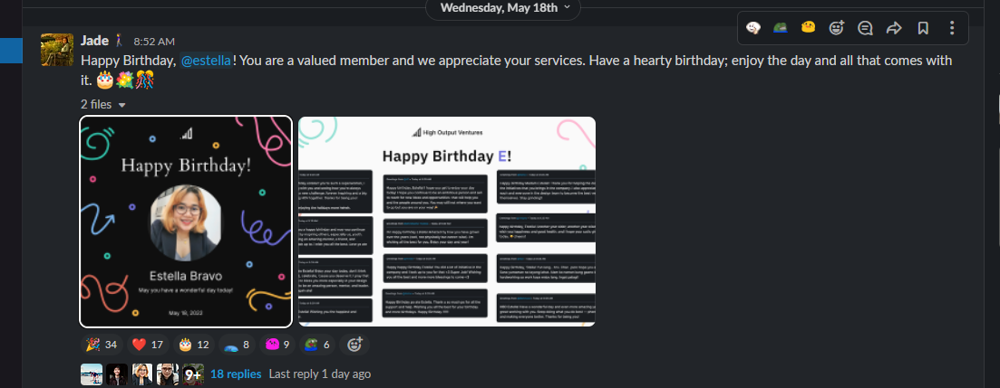

# Remotion Expirement

A [React](https://beta.reactjs.org/) library for creating and rendering videos inside a react component

<br/>


<br/>

## Authors

- [Glevinzon Dapal](https://app.identifi.com/profile/00a0128bdc38887a855480f7c38ffe84)
- [John Paul Calvo](https://app.identifi.com/profile/00207ec81649ceb1e43f13873ec5498a)

---

## Goal Statements

At the end of this experiment, we should be able to

1. Explore remotion and its tools within
1. Add new flavour to the current setup where we only use static/text content. If we can generate video using a service that we developed ourselves, it will open opportunities for us to level up our content creation, and hopefully can turn into a potential product.

<br>



<br>

---

## Abstract

---

## Conclusion

---

## Resources

- https://www.remotion.dev/
- https://www.figma.com/file/rLuqhBp8fYX1Wr6ysfk65M/Banner-Assets-Q2-Y2022?node-id=223%3A2482

[](https://www.youtube.com/watch?v=deg8bOoziaE)

<br/>

[](https://www.youtube.com/watch?v=1cD_F3j8a5c)

<br/>

[](https://www.youtube.com/watch?v=VOX98RoITMk)

<br/>

---

## Documentation

<br>

### Components/Hooks/Utils

<br>

- `Composition` is used to register a component to be displayed as video.
- `Sequence` a component that lets you control what component(s) appear on your video based on the frame.
- `AbsoluteFill` automatically centers a component in the screen
- `Img` can be used instead of `img` to ensure that a particular image gets loaded before frame is rendered
- `staticFile` is typically used to import assets eg. images under `src/public`
- `Audio` component to be used when rendering an audio which accepts a lot of useful props
- `useCurrentFrame` returns the current frame index/number
- `useVideoConfig` returns the video settings. `fps`, `durationInFrames`, `width`, `height`, `id`, `defaultProps`. More info [here](https://www.remotion.dev/docs/use-video-config)
- `interpolate` helps in creating animations. Example if we want a `fade in` effect, it will generate an opacity value for us to be used at a certain point of time
- `Video` component wraps native `video` element and accepts all of its props excluding `autoplay` and `controls`. Also comes with additional props `endsAt` and `startsFrom` (which do exactly what thier name sounds)
- `spring`

### Plugins

- `@remotion/player`
- `@remotion/three`
- `@remotion/gif`

<br>
<br>

### How Tos

- How to use `Composition`

  - using composition is pretty straight forward. you just have to invoke it inside your entry point which is `src/index.ts` then pass in the required props.

  <br>

  ```typescript
  import {Composition} from "remotion";
  import {AwesomeComponent} from "./awesome-component";

  export const Video = () => {
    return (
      <>
        <Composition
          id="AwesomeComponent"
          component={AwesomeComponent}
          width={1080}
          height={1080}
          fps={30}
          durationInFrames={30 * 10}
        />
      </>
    );
  };
  ```

- How to use `AbsoluteFill`
  <br>

  ```typescript
  export const Component = () => {
    return (
      <AbsoluteFill>
        <SomeComponent />
      </AbsoluteFill>
    );
  };
  ```

  > using absolute fill is equivalent to having a `div` with the ff. styles below

  ```css
  .absolute-fill {
    top: 0;
    left: 0;
    right: 0;
    bottom: 0;
    width: 100%;
    height: 100%;
    display: flex;
    flex-direction: column;
  }
  ```

- How to use `Sequence`

  - To use the `Sequence` component you just need to import it from `remotion` package and use it inside your custom components
    <br><br>

  ```typescript
  import {Sequence} from 'remotion';

  const MyComponent = () => {
  return (
    <>
    <Sequence from={<number>}>...</Sequence>
    </>
  );
  };
  ```

  - To control the order of what component shows up on the screen at a specific frame, you can pass a `from` props which tells `Sequence` what frame a particular component should be rendered and to hide it we could pass `durationInFrames` (and both accepts a number)
    <br><br>

  ```typescript
  import {Sequence} from "remotion";

  const MyComponent = () => {
    return (
      <>
        <Sequence from={0} /* from frame 0 */>
          <Component1 />
        </Sequence>
        <Sequence from={5} durationInFrames={6} /* from frame 5 to frame 10 */>
          <Component2 />
        </Sequence>
        <Sequence from={10} /* from frame 10 */>
          <Component3 />
        </Sequence>
      </>
    );
  };
  ```

  On the example above, output will be a video and when played will first show the `<Component1>` then `Component2`, and finally `Component3` but at the same time `Component2` will be unmounted.

  ```
  Frame: 1 ---- 5 ---- 10 - 11 ---- x
        C1     C1     C1 - C1 ...
                C2     C2
                      C3 - C3 ...
  ```

- How to use `interpolate`
  <br><br>

  ```typescript
  import {interpolate, useCurrentFrame} from "remotion";

  const frame = useCurrentFrame();
  const opacity = interpolate(
    frame,
    [0, 50] /* from frame 0 to 50 */,
    [0, 1] /* start at opacity 1 to 0 */
  );

  export const Component = () => {
    return (
      <div
        style={{
          opacity,
        }}
      >
        ...
      </div>
    );
  };
  ```

  On the example above, the code will output a `div` component with a `fade-in` effect.
  The animation will start at frame `0` and will end at frame `50`.

  [](https://www.youtube.com/watch?v=sff_CdWw_-c)

  <br/>

- How to use `@remotion/player`
  <br>
  **NOTE :**
  To use this plugin you have to bootstrap a new react app (using something like `vite`, `next`, `cra` or etc.).
  <br>
  To get started with, open the folder that you've just bootstraped and run the command below

  ```bash
  npm i remotion @remotion/player
  ```

  Next is to create a sample component and place this content

  ```typescript
  export default function Example() {
    return (
      <>
        <Sequence from={0} durationInFrames={15}>
          Hello
        </Sequence>
        <Sequence from={15}>World</Sequence>
      </>
    );
  }
  ```

  Now, go to `app.js` or `index.js` or whatever your app's entrypoint is and paste the snippet below

  ```typescript
  import Example from "~/components/example.tsx";

  export default function App() {
    return (
      <>
        <Player
          component={Example}
          durationInFrames={30 * 100}
          compositionWidth={400}
          compositionHeight={400}
          fps={30}
          controls
        />
      </>
    );
  }
  ```

  <br>
  <br>

### Remotion Plugins

  <br>
  <br>

- `Player` - used to render a your composition in a React component. eg. rendering a video on a landing page

  ```typescript
  import {Player, PlayerRef} from "@remotion/player";
  import {Sequence} from "remotion";

  function MyVideo() {
    return (
      <>
        <Sequence from={0}>Hello</Sequence>
        ...
      </>
    );
  }

  export default function Component() {
    const ref = useRef<PlayerRef>(null);

    const play = () => {
      if (ref.current?.paused) {
        ref.current?.play();
      }
    };

    return (
      <>
      <Player
        ref={ref}
        fps={30}
        durationInFrames={30 * 15}
        component={MyVideo}
        compositionWidth={650}
        compositionHeight={550}
        inputProps={
          {
            /* props to be passed down to `MyVideo` component  */
          }
        }
      />

      <button onClick={play}>
      </>

    );
  }
  ```

  **Other props**

  - loop
  - autoPlay
  - showVolumeControls
  - allowFullscreen
  - clickToPlay
  - doubleClickToFullscreen
  - spaceKeyToPlayOrPause
  - errorFallback
    <br>
    <br>

- `useAudioData` - used to get the information of an audio

  ```typescript
  import {useAudioData} from "@remotion/media-utils";

  export default function Component() {
    const audioData = useAudioData(audio); // use `getAudioData` if outside a react component

    if (!audioData) return <>Failed to get audio info</>;

    console.log(
      audioData.channelWaveforms, // [Float32Array, Float32Array]
      audioData.durationInSeconds, // number
      audioData.isRemote, // boolean
      audioData.numberOfChannels, // number
      audioData.resultId, // string
      audioData.sampleRate // number
    );

    return (
      <>
        <pre>{JSON.stringify(audioData, null, 4)}</pre>
      </>
    );
  }
  ```

- `visualizeAudio` - returns an array of values describing the amplitude of each frequency range

  ```typescript
  import {useAudioData, visualizeAudio} from "@remotion/media-utils";
  import {useCurrentFrame, useVideoConfig} from "remotion";

  export default function Component() {
    const frame = useCurrentFrame();
    const {fps} = useVideoConfig();
    const audioData = useAudioData(audio);
    const visualization = visualizeAudio({
      fps,
      frame,
      audioData,
      numberOfSamples: 8,
    });

    console.log(visualization); // Array with length of `numberOfSamples`

    return (
      <div
        style={{
          display: "flex",
          alignItems: "flex-end",
          gap: 8,
        }}
      >
        {visualization.map((value) => (
          <div
            style={{
              width: 16,
              height: value * 10,
              backgroundColor: "blue",
            }}
          />
        ))}
      </div>
    );
  }
  ```

- `usePlayingState` - hook that returns a state if whether **Player** is playing or not and a dispatch function to play/pause the **Player**

  ```typescript
  import {usePlayingState} from "remotion/dist/timeline-position-state";

  export default function Component() {
    const [state, setState] = usePlayingState();

    console.log(state); // boolean

    const fn = () => {
      setState(<boolean>) // stops or plays the Player
    }

    ...
  }
  ```

- `interpolateColors` - this is the same to [interpolate](https://www.remotion.dev/docs/interpolate) but is specific to colors

  ```typescript
  import {interpolateColors, useCurrentFrame} from "remotion";

  export default function Component({text}: {text: string}) {
    const frame = useCurrentFrame();
    const color = interpolateColors(frame, [0, 100], ["red", "blue"]);

    console.log(color); // rgba color between red and blue

    return <div style={{color}}>{text}</div>;
  }
  ```

- `getVideoMetadata` - gets video information. much like `getAudioData` but returns a promise

  ```typescript
  import {getVideoMetadata, VideoMetadata} from "@remotion/media-utils";
  import * as React from "react";

  export default function useVideoMetadata(videoSrc: string) {
    const [metadata, setMetaData] = React.useState<VideoMetadata | null>(null);

    React.useEffect(() => {
      getVideoMetadata(videoSrc).then(setMetaData);
    }, [videoSrc]);

    if (metadata) {
      console.log(metadata.aspectRatio); // number
      console.log(metadata.durationInSeconds); // number
      console.log(metadata.isRemote); // boolean
      console.log(metadata.height); // number
      console.log(metadata.width); // number
    }

    return metadata;
  }
  ```

- `Loop`

  ```typescript
  import {Loop} from "remotion";

  export default function LoopedComponent() {
    return (
      <Loop durationInFrames={50} times={3}>
        Your content goes here
      </Loop>
    );
  }
  ```

- `delayRender` and `continueRender` - signals the player to not render the frame yet until `continueRender` is called

  ```typescript
  const handle = useEffect(() => delayRender());

  // after fetching
  continueRender(handle);
  ```

- `spring` - is use to add more effect to animations like making it smoother or bouncy. We can also tandem this to interpolate so we can control what frame the animation starts and ends

  ```typescript
  const frame = useCurrentFrame();
  const {fps} = useVideoConfig();

  const marginTop = spring({
    frame,
    from: 0,
    to: 50,
    fps,
    config: {
      mass: 1, // the weight. reducing this will make animation faster
      damping: 10,
      stiffness: 100, // affects how bouncy is the animation
      overshootClamping: false,
    },
  });
  ```

  <br>

  [](https://www.youtube.com/watch?v=GE8ZqrKqE5g)

- `Series` and `Series.Sequence`

  ```typescript
  export default function Component() {
    return (
      <Series>
        <Series.Sequence durationInFrames={15}>
          <Component1 />
        </Series.Sequence>
        <Series.Sequence durationInFrames={30}>
          <Component2 />
        </Series.Sequence>
        <Series.Sequence durationInFrames={45}>
          <Component3 />
        </Series.Sequence>
      </Series>
    );
  }
  ```

- `@remotion/three` - a plugin to render `react-three-fiber` components inside composition

  ```javascript
  import {ThreeCanvas} from "@remotion/three";
  import {useVideoConfig} from "remotion";

  function Component() {
    const {width, height} = useVideoConfig();

    return (
      <ThreeCanvas
        orthographic={false}
        width={width}
        height={height}
        camera={{
          fov: 75,
          position: [0, 0, 470],
        }}
        style={{
          backgroundColor: "white",
        }}
      >
        <boxGeometry args={[100, 100, 100]} />
      </ThreeCanvas>
    );
  }
  ```

### Issues

- Unexpected `Audio` behaviour in `StrictMode`
  - <https://github.com/remotion-dev/remotion/issues/957>
  - <https://github.com/remotion-dev/remotion/issues/723>

### Limitations

- Download the composed video when using `Player` on demand. Eg. on button click
  - <https://github.com/remotion-dev/remotion/issues/655>
