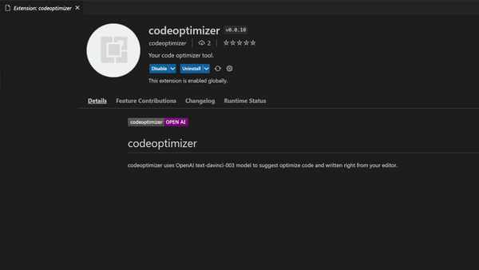

# codeoptimizer

codeoptimizer uses OpenAI text-davinci-003 model to  suggest optimize code and written right from your editor. 

 
 # Extension Settings

Adding OpenAI API key in extension settings

 